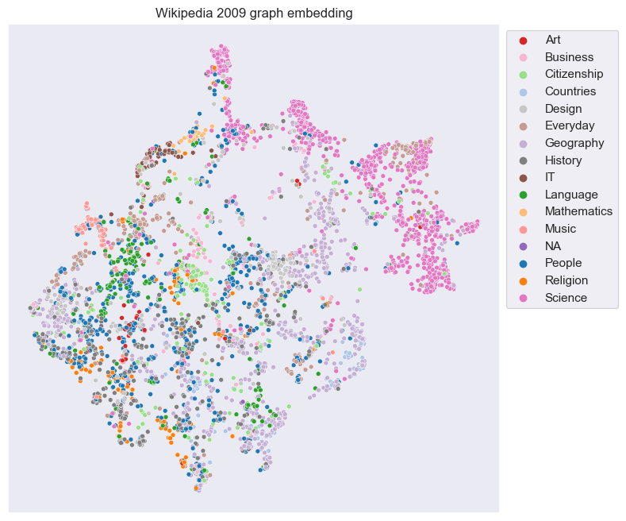
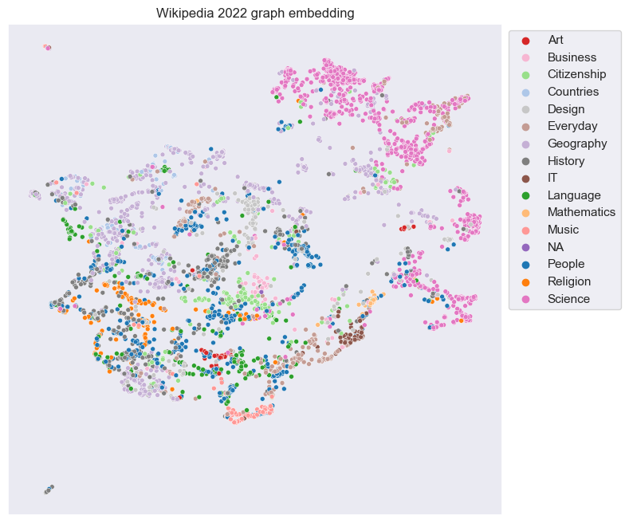
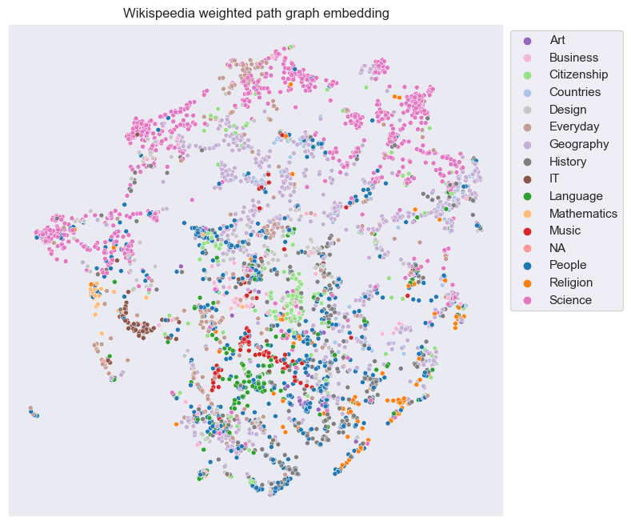
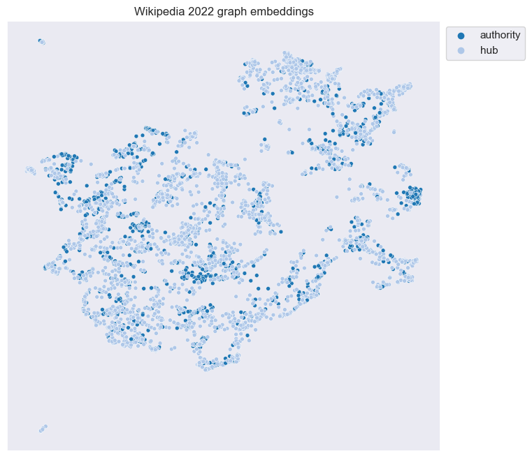

# Wikipedia Link Structure - Is it Developed in An Intuitive Way?

## Abstract
The purpose of this data analysis is to investigate the link structure of Wikipedia and analyse if and how well it corresponds to human intuition. From there, we are going to explore if Wikipedia, when developing the content of their pages, take this into consideration. This will be done in two parts. (1) Comparing the graph of the link structure of Wikipedia 2009 to a graph of how humans navigate the link structure of Wikipedia. The second graph is constructed from recorded games of Wikispeedia, a game where the task is to navigate from one page to another using only the links on each page respectively. (2) In the second part we compare the first graph from part one to a graph constructed of the same Wikipedia pages from 2022. Thus, we can compare the development of the pages over time. Depending on the answer to part 1, we will analyse if the link structure has improved or decayed in relation to how humans navigate Wikipedia. The dataset represents a subset of all wikipedia pages. For both time periods the same subset of Wikipedia pages will be analysed.

## Research Questions
1. How well did the link structure of Wikipedia follow human intuition in 2009?
2. How has the Wikipedia link structure evolved between 2009 and 2022?

## Proposed additional datasets
In addition to the Wikispeedia dataset, we have scraped the same subset of pages of Wikipedia (in 2022) as are present in the wikispeedia dataset.

Processing the new version of the circa 4600 pages will include:
* Scraping the complete content of the pages with html tags
* Indetifying outgoing links of each page and creating a dataset with an origin column (representing the page of which the links are extracted) and a destination column (representing the links found on that page)
* Data size is expected to be of the same order of magnetude as the 2009 dataset, which was ~3 MB, if we choose to only work with the links

## Methods
To acomplish these goals, we intend to use the methods described below.

**Node2Vec**
Node2Vec is used to embed the nodes of the graph as vectors. With these embeddings for each article we can perform both qualitative and quantitative comparisons of graphs.

**UMAP**
Uniform Manifold Approximation and Projection (UMAP) we are able to take the high-dimensional embeddings generated by node2vec and project them into a low-dimensional space, e.g. 2D or 3D. Given these projections a qualitive comparison can be made between graphs according to for example what categories cluster together on the local/global scale. See the below examples.

**HITS**
Hyper-link Induced Topic Search (HITS) can be used to get a binary classification of a graph into hubs and authorities. In short, hubs are nodes that link to many authorities, and authorities are nodes that are linked to by many hubs. To get another perspective of the embeddings plots created with UMAP we can use HITS to categorize nodes, and compare the resulting plots between graphs.

    

**How to determine the relevance of the link structure as proposed in the RQs?**
We propose a two step methodology to answer the RQs and determine relevance of the links. The first step is to find the centroid of each category in their 128 dimensional embedding space. We then measure the cosine similarity between the centroids. From this we will receive an appreciation for the similarity between the different categories. We hypothesize that subjects with a higher similarity score are more relevant to each other than two that are distant. An alternative approach to measuring the distance between the centroids is to use a heatmap where the categories are represented on both the X and Y axis. In the intersection of the table of category A and category B, we find the number of outgoing links from A to B. Similarly, in the intersection of B and A, we find the number of outgoing links from category B to A. The argument favouring the former approach is the intuition of relevance. If category A is relevnant to category B then category B should be equally relevant to category A.

The second step is to observe the link structure over the two periods and evaluate wether or not it has chagned. In order to do that we construct bipartite graphs where on one side all the articles are listed and on the other side the 16 categories are listed. Edges are drawn between each article and each category with weights representing the number of outgoing links from the article to each category. One such bipartite graph will be constructed for each period (2009 and 2022). When observing differences and similarities of the two graphs we will be able to interpret how changes have occurred over time. One scenario could be that an article `A` had in 2009 an edge weight 10 to category 1:10. In 2022 the edge weights have changed to 0 for category 1:5 while increasing their values to 15 for categories 6:10. Seeing this, we can observe how the categories are related to each other through comparing their similarity scores. Hopefully what we will find is that more links have been added to relevant categories and links have been deleted to irrelevant categories. 

## Proposed timeline
A high level timeline follows below. 

**End of week 49**
Detailed investigation of the data
- All fundamental statistics and visualisations are developed.
- At this point, the investigation is at a point where we understand what parts are interesting to look further into. 

**End of week 50**
Data story in progress
- High level outline of descrition of data story.
- Plots and descriptive statistics fully prepared.

**End of week 51**
Datastory compleated 
- Write the full description of the story.
- Double check every task and make sure plots have all requiered attributes for effective visualisation. 

## Tasks of individual team members
* Amey: Quantitative and qualitative graph analysis
* Herman: Explore further quantitative comparison methods
* Oskar: Writing of the data story, exploring presentation possibilities 
* Rickard: Continue working on graph embedding analysis, explore further comparison methods (doc2vec) 

## Questions to TA

a) How should we handle articles with multiple categories?

