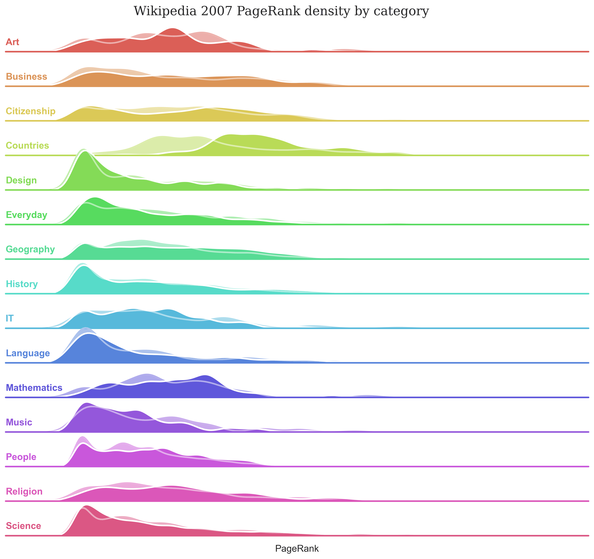

# Wikipedia Link Structure - Is it Developed in An Intuitive Way?

## Abstract
The purpose of this data analysis is to investigate the link structure of Wikipedia and analyse if and how well it corresponds to human intuition. From there, we are going to explore if Wikipedia, when developing the content of their pages, take this into consideration. This will be done in two parts. (1) Comparing the graph of the link structure of Wikipedia 2007 to a graph of how humans navigate the link structure of Wikipedia. The second graph is constructed from recorded games of Wikispeedia, a game where the task is to navigate from one page to another using only the links on each page respectively. (2) In the second part we talk about the relative positions of links on Wikipedia pages and the effect it has on players clicking the link. The dataset represents a subset of all wikipedia pages. For all time instances the same subset of Wikipedia pages will be analysed.

## Research Questions
1. How has the Wikipedia link structure evolved between 2007 and 2022?
1. Are players biased towards links higher up on the page?

## Additional datasets
In addition to the Wikispeedia dataset, we have scraped the same subset of pages of Wikipedia (from 2007 - 2022) as are present in the wikispeedia dataset.

Processing the new version of the circa 4600 pages included:
* Scraping the complete content of the pages with html tags
* Identifying outgoing links of each page and creating a dataset with an origin column (representing the page of which the links are extracted) and a destination column (representing the links found on that page)
* Data size progressively increases over the years.

## Methods
To acomplish these goals, we intend to use the methods described below.

We used the following methods to create embeddings for the nodes of the graph:

**Node2Vec**
Node2Vec is used to embed the nodes of the graph as vectors. With these embeddings for each article we can perform both qualitative and quantitative comparisons of graphs.

**UMAP**
Uniform Manifold Approximation and Projection (UMAP) we are able to take the high-dimensional embeddings generated by node2vec and project them into 3D. Given these projections a qualitive comparison can be made between graphs according to for example what categories cluster together on the local/global scale. 

 

3D versions can be found in our <a href="https://epfl-ada.github.io/ada-2022-project-deadmaus/#What%20does%20our%20data%20look%20like?">data story</a>.

**How to characterise the evolution of Wikipedia's link structure**

We characterised Wikipedia primarily throught two perspectives: Pagerank and Categories.

A heatmap where the categories are represented on both the X and Y axis was created. In the intersection of the heatmap at row A and column, we find the number of outgoing links from category A to B.

The pagerank of each page in Wikipedia 2007 - 2022 was calculated. They were then compared to the pagerank of the graph generated by the Wikispeedia paths.

We then plotted the degree distribution for the outgoing and incoming links, as well as the pagerank distribution of the graph of Wikipedia from 2007 to 2022.
We observed that in all cases the distribution became more evenly over time. This indicated that the pages were developed in a manner such that Wikipedia, on the whole, became more well-connected.

Next, we segmented our data by category of the article, and repeated the previous analysis of the pagerank for each category. For every category, we compared the evolution of its pagerank over time with the pagerank distribution obtained from the Wikispeedia graph. A noteworthy observation that we made was:

For the "Countries" category, we observed a marked difference between the pagerank distributions of Wikipedia and Wikispeedia. While Wikipedia considered pages to be very central, Wikispeedia suggested that users did not perceive these pages to be particularly central.

**How to determine the whether link position affects the player clicking on the link**

We are investigating the following hypothesis: "Wikispeedia users are biased towards clicking links higher on the page".
Our study is defined as follows:
Treatment: The position of the link chosen by the player on the page.
Control: The position of a link on the page chosen proportionally to the cosine similarity of said link to the destination page.
Outcome: Number of times the link was clicked on given the same page and destination.
Confounders: Pagerank and Category
We propose the following causal diagram:

We can control for the effects of Pagerank and Category by using a propensity score. We selected a total of 16 confounders: Pagerank, and a binary (0 or 1) value for each of the 15 categories. We then used logistic regression to obtain a propensity score for every page. 

For every (page, destination) pair, we calculate the cosine similarity between every link on that page and the destination page and choose the link for our control with a probability proportional to the calculated cosine similarities. The reason for doing so is to simulate the human intuition behind link choices. We use the embeddings of the Wikipedia pages from 2007 as a proxy for human intuition, since they were developed by humans. 

With these methods, we isolated the effect of link position on the number of clicks. 
 
We can see that after controlling for pagerank and category the control group has slightly shifted towards the treatment group, but it is still not as concentrated at the top of the page as the treatment group. Running an independent t-test on the two groups shows us that the mean of the treatment group is significantly lower (i.e biased towards links higher on the page) than the control group, with a p-value of 1e-12.

We therefore conclude that the position of a link on the page most likely does affect the chance of that link getting clicked by a Wikispeedia user.

## Tasks of individual team members
* Amey: Quantitative and qualitative graph analysis, data scraping
* Herman: Explore further quantitative comparison methods, implement data story website
* Oskar: Writing of the data story, exploring presentation possibilities 
* Rickard: Graph embedding analysis, data wrangling

