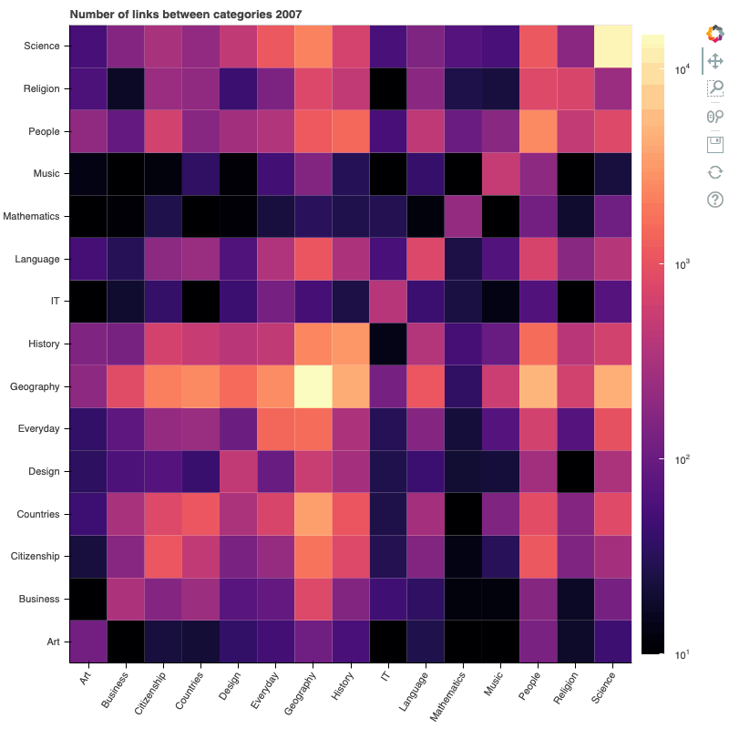

# Wikipedia Link Structure - Is it Developed in An Intuitive Way?

## Abstract
The purpose of this data analysis is to investigate the link structure of Wikipedia and analyse if and how well it corresponds to human intuition. From there, we are going to explore if Wikipedia, when developing the content of their pages, take this into consideration. This will be done in two parts. (1) Comparing the graph of the link structure of Wikipedia 2007 to a graph of how humans navigate the link structure of Wikipedia. The second graph is constructed from recorded games of Wikispeedia, a game where the task is to navigate from one page to another using only the links on each page respectively. (2) In the second part we compare the first graph from part one to a graph constructed of the same Wikipedia pages from 2022. Thus, we can compare the development of the pages over time. Depending on the answer to part 1, we will analyse if the link structure has improved or decayed in relation to how humans navigate Wikipedia. The dataset represents a subset of all wikipedia pages. For both time periods the same subset of Wikipedia pages will be analysed.

## Research Questions
1. How has the Wikipedia link structure evolved between 2007 and 2022?
1. Are players biased towards links higher up on the page?

## Additional datasets
In addition to the Wikispeedia dataset, we have scraped the same subset of pages of Wikipedia (from 2007 - 2022) as are present in the wikispeedia dataset.

Processing the new version of the circa 4600 pages included:
* Scraping the complete content of the pages with html tags
* Indetifying outgoing links of each page and creating a dataset with an origin column (representing the page of which the links are extracted) and a destination column (representing the links found on that page)
* Data size is expected to be of the same order of magnetude as the 2007 dataset, which was ~3 MB, if we choose to only work with the links

## Methods
To acomplish these goals, we intend to use the methods described below.

**Node2Vec**
Node2Vec is used to embed the nodes of the graph as vectors. With these embeddings for each article we can perform both qualitative and quantitative comparisons of graphs.

**UMAP**
Uniform Manifold Approximation and Projection (UMAP) we are able to take the high-dimensional embeddings generated by node2vec and project them into 3D. Given these projections a qualitive comparison can be made between graphs according to for example what categories cluster together on the local/global scale. 

  

3D versions can be found in our <a href="https://epfl-ada.github.io/ada-2022-project-deadmaus/#What%20does%20our%20data%20look%20like?">data story</a>.

**How to characterise the evolution of Wikipedia's link structure**
We characterised Wikipedia primarily throught two perspectives: Pagerank and Categories.

A heatmap where the categories are represented on both the X and Y axis was created. In the intersection of the table of category A and category B, we find the number of outgoing links from A to B. Similarly, in the intersection of B and A, we find the number of outgoing links from category B to A. The argument favouring the former approach is the intuition of relevance. If category A is relevant to category B then category B should be equally relevant to category A.

The pagerank of each page in Wikipedia 2007 - 2022 was calculated. They were then compared to the pagerank of the graph generated by the Wikispeedia paths.

**How to determine the whether link position effects the player clicking on the link**
We propose the following causal diagram:

We can control for the effects of Pagerank and Category by using a propensity score. We selected a total of 16 confounders: Pagerank, and a binary (0 or 1) value for each of the 15 categories. We then used logistic regression to obtain a propensity score for every page. 

However, confounders like human intuition is harder to manually control for. Hence, we will use data from the graph embeddings to do matching. For every (page, destination) pair, we calculate which link on that page has the highest cosine similarity to the destination page. That link will be used as a control pair to the link that the player actually clicked on. This underlying embeding sources from  Wikipdia editors in 2007, which will control for human intuition of that time and other unknown confounding factors. 

With these methods, we would be able to isolate the effect that link position has on the player clicking the link. For the purposes of statistical hypothesis testing, a paired t-test was chosen.

## Tasks of individual team members
* Amey: Quantitative and qualitative graph analysis, data scraping
* Herman: Explore further quantitative comparison methods, implement data story website
* Oskar: Writing of the data story, exploring presentation possibilities 
* Rickard: Graph embedding analysis, data wrangling

